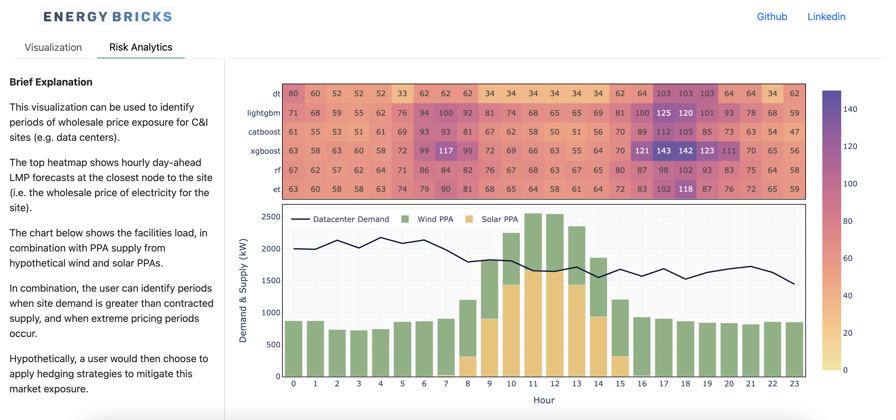

<h1 align="center">
	
</h1>

<h3 align="center">
	Measuring wholesale energy market exposure, NEISO
</h3>

	<strong>
		<a href="https://m.roeck-us.net">App</a>
		•
		<a href="https://www.iso-ne.com/isoexpress/web/charts">Data</a>
		•
		<a href="">Contact</a>
	</strong>

	
	
	

	

## Overview
Energy Bricks is a simple framework for analyzing wholesale energy market risk exposure for wholesale electricity buyers with C&I facilities. The tool utilizes day-ahead Locational Marginal Price forecasting to identify hours with high price and market exposure. To-date the tool is built for NEISO, and utilizes several different regression and ML models for forecasting.

Features include:

* Day-Ahead Locational Marginal Pricing, used to inform hourly risk and cost management strategies.
* Visualization of wholesale prices against forecasts, utilizing model validation data.
* Trained regression and machine learning pipelines for nodal price forecasting in NEISO.

## Usage

Energy Bricks has two primary components: (1) a data pipeline and trained forecasting models to forecast LMP pricing, and (2) a dashboard that combines pricing with site-specific information, namely demand and power purchase agreements. 

#### Data Pipeline and Forecasting Models

The forecasting model is built in Jupyter Notebooks, and can be found in the 'notebooks' folder of this repository. The actual models are built using pycaret, but can also be loaded directly. For more information on the data pipeline, see the following section.

#### Dashboard

The dashboard houses two pages: (1) a visualization of model performance using validation data, and (2) 

## Data Pipeline

The following visual describes the data pipeline utilized for the forecast and consequent risk management visualization.

	

In order to address underlying uncertainties in the input data, the framework utilizes multiple forecasts, which in turn produce a range of potential outcomes. In conjuction, the models componesate for different sets of uncertainties, and in combination captures the extreme pricing events which the tool is designed to identify.

## Brief Analysis of Model Results

The six highest performing models were selected according to their mean percentage error.

	

	

	

	

