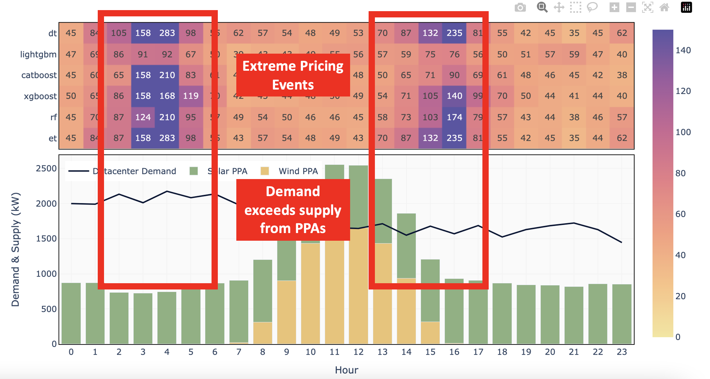

<h1 align="center">
	
</h1>

<h3 align="center">
	Measuring wholesale energy market exposure, NEISO
</h3>

	<strong>
		<a href="https://m.roeck-us.net">App</a>
		•
		<a href="https://www.iso-ne.com/isoexpress/web/charts">Data</a>
		•
		<a href="">Contact</a>
	</strong>

	
	

	

## Overview
Energy Bricks is a simple framework for analyzing wholesale energy market risk exposure for wholesale electricity buyers with C&I facilities. The tool utilizes day-ahead Locational Marginal Price forecasting to identify hours with high price and market exposure. To-date the tool is built for NEISO, and utilizes several different regression and ML models for forecasting.

Features include:

* Day-Ahead Locational Marginal Pricing, used to inform hourly risk and cost management strategies.
* Visualization of wholesale prices against forecasts, utilizing model validation data.
* Trained regression and machine learning pipelines for nodal price forecasting in NEISO.

## Instructions

Energy Bricks has two components: (1) data pipeline and trained models, and (2) a dashboard to uncover market exposure.

#### Dashboard

The dashboard is used to identify periods of extreme pricing events, in combination with periods when PPA energy supply is less than facility demand. This is visualized in the image below.

	

In combination, these conditions lead to **wholesale market exposure.** This events can be mitigated day-ahead using systematic hedging strategies, for example.

#### Data Pipeline and Forecasting Models

The forecasting model is built in Jupyter Notebooks, and can be found in the 'notebooks' folder of this repository. For more information on the data pipeline, see the following section.

## Data Pipeline

The following visual describes the data pipeline utilized for the forecast and consequent risk management visualization.

	

In order to address underlying uncertainties in the input data, the framework utilizes multiple forecasts, which in turn produce a range of potential outcomes. In conjuction, the models componesate for different sets of uncertainties, and in combination captures the extreme pricing events which the tool is designed to identify.

## Sanity Checks

The six highest performing models were selected according to their mean percentage error. A quick plot of our leading models feature important plot shows that historic prices and demand forecasts have the greatest influence on pricing. We see that calendar variables have a minor impact. In the future, the model could be updated to include the hour of the day as a variable, which is likely to have a significant impact.

	

In addition, a plot of residuals for the leading model shows an equal distribution across the range of predicted values. We see several outliers in the training data that could have effected the model as a whole. 

	

